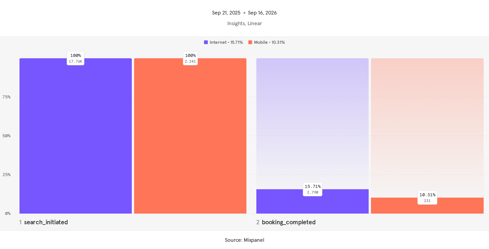

# Hi, I'm Deepali Sutar 👋

Data Analyst with experience in SQL, Advanced Excel, and SAS, currently working on a standardization initiative at Citi for the Acquisitions Startegy team. Previously led a Business Insights and Analytics team at ZS Associates, supporting a pharma client in Italy while based in India — comfortable working async, across time zones, with minimal oversight.

I'm expanding my toolkit with Tableau and product analytics platforms like Mixpanel, and actively looking for remote, international Data Analyst opportunities.

📍 Based in India | Open to remote and international opportunities
🔗 [LinkedIn](https://www.linkedin.com/in/deepali-gopal-sutar/)

---

## Project 1: Airline Booking Funnel Analysis

**Where do we lose customers, and is it worse for any channel or trip type?**

Analyzed ~50,000 real airline booking attempts to find where the booking flow leaks conversions, then validated the findings across three tools.

**Key finding:** Mobile converts ~30% lower than Internet (10.84% vs. 15.48%), confirmed independently in SQL, Tableau, and Mixpanel.

**Tools used:** SQL (BigQuery) · Tableau Public · Mixpanel

- 📊 [View the Tableau Dashboard](https://public.tableau.com/views/AirlineBookingFunnel/Dashboard1?:language=en-GB&publish=yes&:sid=&:redirect=auth&:display_count=n&:origin=viz_share_link)
- 📄 [Read the One-Pager (PDF)](Project1_Airline_Booking_Funnel_OnePager.pdf)
- 🖼️ Mixpanel funnel screenshot:

---

## More projects coming soon

I'm actively building out additional projects covering retention/cohort analysis, churn, and A/B testing — check back soon, or reach out if you'd like to chat about my work.
